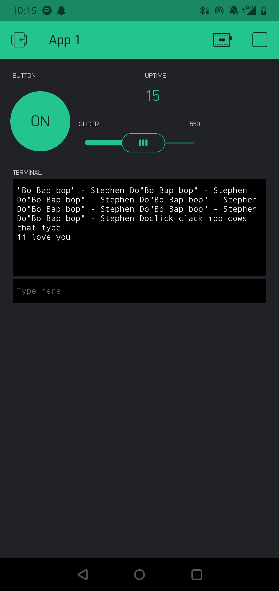

Name:

EID:

Team Number:

## Questions

1. What is the purpose of an IP address?

    To identify every machine accessing a netowrk.

2. What is a DNS? What are the benefits of using domain names instead of IP addresses?

    A DNS maps the IP adress' of the machines on LAN to a symbolic name

3. What is the difference between a static IP and a dynamic IP?

    A static IP doesn't change as a machine connects over time from different locations, while dynamc IP's change
    based on network connnection.

4. What is the tradeoff between UDP and TCP protocols?

    UDP sends the data at the fastest speed possible without concern for integrity, and TCP sends data with emphasis 
    on data integrity not speed.

5. Why can't we use the delay function with Blynk?

    Blynk obscures the data floe from us, so we can't use a delay function as it would ruin the timing of the system.

6. What does it mean for a function to be "Blocking"?

    A function is blocking if it prevents other segments of code from executing while it is running

7. Why are interrupts useful for writing Non-Blocking code?

    Interrupts are good for non-blocking code because it allows for the PC to be moved at any time allowing for 
    execution of other instructions

8. What is the difference between interface and implementation? Why is it important?

    Interface is how a function is called, but implemtation is the code that allows the function to perform a task.
    This is important because a function can be called properly, but its implementation can be wrong leading to errors.

9. Screenshot of your Blynk App:

    
